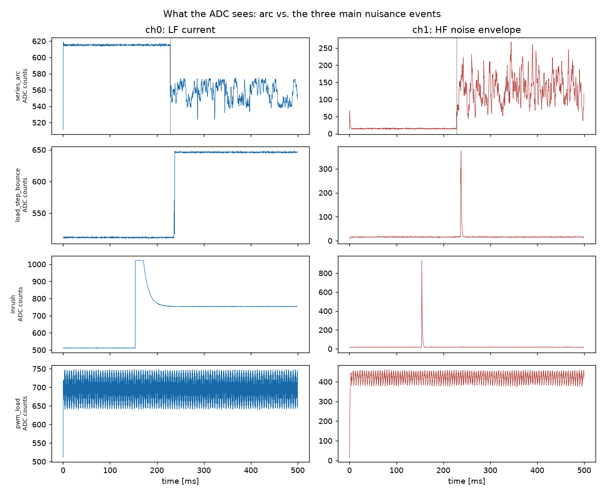
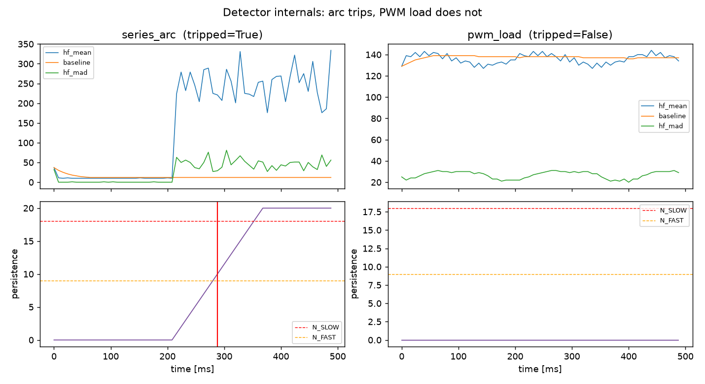

# DC Arc-Fault (and Ground-Fault) Detection for Low-Voltage DC Wiring

An end-to-end arc-fault detector for a DC line (24–28 V, 1–5 A bench
scale): analog sensing front end, Arduino Mega 2560 detection firmware, a
perfboard MOSFET switching stage that opens the line on trip, and — the
part that makes the rest trustworthy — a physics-based waveform simulator
and Monte-Carlo validation harness that the detection algorithm was
developed against *before* being ported to hardware.

The detector distinguishes a genuine arcing fault from the events that fool
naive detectors — load switching with contact bounce, inrush, PWM loads,
brushed-motor noise — and trips in ~75–150 ms, long before a hazardous
condition (sustained heating, insulation fire) develops.

**Independent, original work using only public engineering knowledge.**
No proprietary material, internal documents, bus designations, part
numbers, or fault data from any employer. This is a personal learning /
portfolio project and is **not a certified protection device**.

## Repository layout

```
sim/waveforms.py        physics-based arc + nuisance waveform generator,
                        including a model of the analog front end
sim/detector.py         Python reference of the detection algorithm
                        (integer math, mirrors the firmware exactly)
sim/validate.py         Monte-Carlo validation: detection/nuisance rates,
                        trip-time stats, threshold sweep, plots
sim/export_test_vectors.py  exports ADC traces + expected decisions
firmware/arc_fault_detector/
    detector_core.h     the algorithm, pure C99, no Arduino dependency
    arc_fault_detector.ino  Mega 2560 sketch: sampling ISR, trip/latch,
                        ground fault, self-test, telemetry
test/host_test.cpp      compiles detector_core.h on a PC and checks
                        bit-for-bit parity with the Python reference
test/run_host_test.sh   one-command parity check
docs/detection-method.md  the algorithm, its physics, and its limitations
docs/hardware.md        sensing chain, switching stage, BOM, bring-up plan
docs/validation-results.md  generated numbers from the last validate run
docs/img/               generated plots
```

## Quick start

```bash
pip install numpy scipy matplotlib
python3 sim/validate.py          # ~2 min: full Monte-Carlo + plots + report
sh test/run_host_test.sh         # prove the C core == Python reference
```

Flash `firmware/arc_fault_detector/` to a Mega 2560 with the Arduino IDE.
Hardware build order is in `docs/hardware.md` §9.

## How it works (short version)

Arc noise is broadband (kHz–MHz); a Mega cannot sample that. So an analog
front end does the wideband work: **band-pass (8–45 kHz) → precision
rectifier → RC envelope**, turning "how much broadband noise is on the
line" into a slow voltage. The MCU samples that envelope plus the filtered
load current at 4 kHz each and computes three integer features per 8 ms
window:

- **A — energy:** envelope above an adaptive per-line baseline
  (baseline learns only from quiet windows, so an arc can't normalize
  itself).
- **B — continuity:** envelope *held up* within the window
  (arc noise is continuous; switch edges / contact bounce / slow-PWM edges
  are impulsive — their envelope sags between impulses).
- **C — chaos:** envelope level *wanders between* windows
  (arc noise is non-stationary; PWM/converter noise is flat).

An arc is the only source that is elevated **and** continuous **and**
non-stationary. A +1/−1 persistence counter must then stay in the majority
for ≈ 144 ms (or ≈ 72 ms if a coincident current step — the arc-voltage
signature — corroborates) before the MOSFET opens and latches. Full method
and failure modes: `docs/detection-method.md`.

A second current sensor on the return conductor gives basic ground-fault
(residual current) protection: sustained ≳150 mA line/return imbalance for
100 ms trips independently of the arc logic.

## Validated performance (simulation, 200 Monte-Carlo trials/class)

| event class | type | trip rate | median trip time |
|---|---|---:|---:|
| steady load | normal | 0 % | — |
| load switch w/ contact bounce | normal | 0 % | — |
| inrush (5–9×, τ 3–25 ms) | normal | 0 % | — |
| PWM load running / switching on | normal | 0 % / ~2 % | — |
| brushed motor | normal | 0 % | — |
| series arc | arc | 100 % | ~75 ms |
| parallel arc | arc | ~98 % | ~75 ms |
| arc igniting under PWM load | arc | 100 % | ~150 ms |

(overall: 99.3 % of arcs detected, 0.33 % nuisance rate across all normal
trials, p95 trip time 165 ms)

Regenerate with `python3 sim/validate.py`; exact numbers land in
`docs/validation-results.md`.




---

## Design decisions and why (the non-obvious ones)

1. **Simulation first, hardware second.** Arcs are dangerous, noisy and
   unrepeatable; you cannot tune thresholds by striking one arc at a time.
   A waveform generator with randomized parameters gives thousands of
   labelled trials and — critically — *adversarial* nuisance cases on
   demand. The algorithm changed shape twice because simulation falsified
   it (see below); that would have taken weeks on a bench.

2. **Analog envelope front end instead of MCU DSP.** The information is at
   8–45 kHz+; the Mega samples ~10 kS/s usefully. Band-pass → rectify → RC
   converts noise *power* into a slow envelope, moving the Nyquist problem
   into three op-amp stages. This is also how commercial AFD ASICs are
   organized. Consequence: the MCU algorithm is trivially cheap (integer
   adds/shifts at 4 kHz) and portable to any small MCU.

3. **The two shape features exist because single-feature designs failed in
   simulation — twice.**
   - *Hypothesis 1:* "arcs are chaotic ⇒ high intra-window variance."
     Inverted by data: after the envelope RC, continuous arc noise is the
     *smooth* signal (MAD/elevation 0.03–0.35) and impulsive interference
     is the spiky one (0.7–5). This became the **continuity** test.
   - *Hypothesis 2:* continuity + energy suffices. Falsified by the
     `pwm_switch_on` case (fast PWM's merged envelope steps up smoothly,
     30/30 false trips). Fixed by adding **stationarity** (chaos test):
     PWM envelope is flat window-to-window; arc envelope wanders.
   The negative results are deliberately preserved in the docs — they are
   the evidence the final design rests on.

4. **HF gain chosen for headroom, not sensitivity (15 V/A, not 40).**
   Early runs saturated the envelope ADC on strong PWM loads; a clipped
   envelope is *flat*, which manufactures the arc signature and caused
   false trips. Detection features live in the waveform's shape ⇒ the
   front end must keep the worst legitimate load linear. Headroom is a
   detection feature.

5. **di/dt is deliberately NOT a trip criterion.** Inrush produces the
   biggest di/dt in the system and is completely legitimate. Current steps
   are used only as *corroboration* to accelerate an HF-based decision —
   they can halve trip time but can never cause a trip alone.

6. **Persistence counter (+1/−1) instead of a one-shot threshold.**
   Contact bounce contains real micro-arcs; any instantaneous criterion
   will fire on it. Requiring a *majority of suspect windows over 144 ms*
   is what turns "arc-like for a moment" into "arcing". The −1 (rather
   than reset-to-0) makes a sputtering arc still accumulate while brief
   bursts decay — and the cap (20) stops a long nuisance event from
   banking credit. The 144 ms number is not sacred: the validation sweep
   (docs/img/tradeoff_sweep.png) shows nuisance >16 % below ~80 ms and
   ~19 % missed arcs at ~190 ms; the knee was chosen biased toward
   catching arcs.

7. **Adaptive baseline that only learns when quiet.** Fixed thresholds
   can't serve both a quiet resistive line and a line with a converter on
   it. But a naive EMA would slowly learn the arc itself as the new
   normal and un-trip. Freezing adaptation whenever feature A fires is the
   one-line fix; the corollary (documented) is that a *pre-existing* noisy
   load raises the floor and masks weak arcs behind it.

8. **Algorithm extracted into `detector_core.h` (pure C99) + bit-for-bit
   host test.** The classic failure of "develop in Python, port to C" is
   silent divergence (rounding, shifts on negatives, off-by-one windows —
   the host test actually caught a 9-vs-8 window baseline-seeding mismatch
   here). 36 exported ADC traces must produce identical trip decisions
   *and trip window indices* in both implementations before anything is
   flashed.

9. **Fail-safe trip polarity + boot self-test.** Gate pull-down means MCU
   dead ⇒ line open; firmware boots with the line open and closes it only
   after the sensing chain reads sane (a disconnected sensor reads a rail
   — the device refuses to arm blind). A protection device that fails
   silently armed is worse than no device, because it changes behaviour
   ("the detector's got it").

10. **MOSFET disconnect, not a relay.** Opening 5 A DC with mechanical
    contacts draws its own arc (no zero-crossings in DC) — using an arc to
    clear an arc. TVS clamping across the switch because interrupting an
    inductive line dumps L·di/dt into the switch: the protector must
    survive its own protective action. Upstream fuse retained: the MOSFET
    handles arcs, the fuse handles the MOSFET failing short.

11. **Ground fault via two sensors and a window-mean subtraction** —
    honest about its floor: two ±1 % sensors at 5 A can mismatch by
    ~100 mA, hence the 150 mA threshold. The correct production answer is
    a core-balance (differential) sensor; kept two discrete sensors here
    for observability and cost, and documented the upgrade path.

12. **ISR owns the ADC, non-blocking.** Read-previous / start-next in a
    12 kHz timer ISR (A0→A1→A2 rotation, 4 kHz each) costs a few µs;
    `analogRead` in an ISR would burn ~85 % of each tick and starve the
    main loop. ADC clock runs at 250 kHz (spec says 200 kHz for full
    resolution) — trading ~1 LSB, irrelevant against a 12-count decision
    floor, for timing margin. Double-buffered windows hand off to the main
    loop with an explicit overrun flag, so a latency bug shows up as a
    serial warning instead of silent data corruption.

## Limitations / nuisance-trip tradeoffs

Fully treated in `docs/detection-method.md` §Limitations — headlines:

- ~3 % nuisance rate on the hardest synthetic case (fast PWM load stepping
  on against a quiet baseline); mitigation paths documented.
- Continuous in-band interference with amplitude jitter (burst-mode
  converters) can mimic all three features — real products add periodicity
  analysis and qualify against load libraries.
- A worn brushed motor *is* an arc source; no signature detector fully
  separates it. Zone/whitelist in practice.
- Strong ambient noise raises the adaptive baseline and masks weak arcs
  (visible in sim: 2× slower trips under PWM).
- Thresholds are validated against synthetic waveforms; structure is
  sound, but numbers need re-tuning against real bench arcs before any
  real-world claim.

---

## How this would be challenged in an interview

**Q1. "Your whole validation is against waveforms you generated yourself.
Why should I believe any of these numbers?"**

You shouldn't — not as absolute rates. The claim is weaker and more
defensible: the *structure* is validated (the algorithm separates the
physical mechanisms — continuous/non-stationary vs impulsive vs stationary
— across wide randomized parameter ranges), and the *methodology* is
validated (the harness caught three real design errors: the inverted
variance hypothesis, the PWM-switch-on false-trip mode, and front-end
clipping). The numbers are hypotheses to be re-measured on a bench arc
generator (pencil-lead/opening-contact behind a current-limited supply),
and the harness is exactly the tool that makes re-tuning cheap: change the
waveform models to match recorded data, re-run, get new thresholds. That's
also how industry does it — UL 1699/1699B arc generators plus load
libraries are the "real" version of this harness.

**Q2. "A 28 V avionics-style bus is full of switching converters. Your own
docs admit a burst-mode converter can satisfy all three features. So it
nuisance-trips in the field — what now?"**

First, contain the blast radius: arc-fault protection is deployed
per-circuit, so a trip takes out one feeder, and criticality decides where
it's fitted at all — on a flight-critical bus a nuisance trip is itself a
hazard, so there you'd use annunciate-only or higher trip thresholds, which
is a system decision, not firmware. Second, engineer the discriminator: the
missing feature is periodicity — arc noise has a smooth autocorrelation,
converter noise has strong periodic structure; that's implementable at
4 kHz on the envelope (lag-domain, few hundred bytes). Third, qualify: run
the actual load library against the device and tune per-zone. And the
honest bottom line: signature-based AFD *always* carries a nuisance floor;
you buy it because the alternative — an undetected series arc — has no
other protection (it sits below any breaker curve by definition).

**Q3. "Why 8 ms windows and 4 kHz? Justify your timescales end-to-end."**

Bottom-up: the envelope RC is 1 ms — fast enough to resolve contact-bounce
gaps (0.1–0.5 ms impulses sag visibly) and slow enough to smooth rectifier
ripple. Window = 8× the RC: long enough for a stable mean (32 samples at
4 kHz), short enough that 18 windows still trip in ~150 ms. The 4 kHz
per-channel rate is set by the envelope's own information bandwidth
(~1/2πτ ≈ 160 Hz) — 4 kHz is >10× oversampled, which the intra-window MAD
feature needs in order to see envelope *shape*, not just level. Trip
budget: DC arcs develop hazardous heating over hundreds of ms to seconds;
75–150 ms detection sits inside that with margin, and the disconnect
itself is µs (MOSFET). The one arbitrary-looking number is the 8–45 kHz
band, and it's bounded on physics: above load-PWM harmonics of
consequence, below the current sensor's 80 kHz rolloff.

**Q4. "You freeze the baseline when feature A fires. Give me a slowly
ramping noise floor — what happens?"**

If the ramp stays below `baseline + max(4·dev, 12)` per step, the EMA
tracks it up and the detector desensitizes — the known blind spot of every
adaptive threshold ("boiling frog"). Defenses, two implemented: `dev`
shrinks on a quiet line (floored at 1 count), so the relative threshold
*tightens* as the line proves itself quiet; and the 12-count absolute
floor can't be trained away. Not implemented but the right answer: bound
how far the baseline may drift from its commissioning value before the
device reports "line degraded" instead of silently adapting — that turns
the blind spot into a maintenance alert. Real arcs, for what it's worth,
don't ramp: ignition is a step, which is exactly what the fast path keys
on.

**Q5. "Your MOSFET opens in microseconds into an inductive feeder. Walk me
through what the wiring sees, and why your trip doesn't cause the next
fault."**

Interrupting current I in loop inductance L forces V = L·di/dt across the
opening switch; with µs turn-off even a few µH of harness rings to
hundreds of volts — enough to avalanche the FET or flash over exactly the
damaged insulation being protected. Mitigations in the design: a TVS
across the MOSFET clamps the drain and absorbs ½LI² (tens of µJ at 5 A and
bench-scale inductance — trivial for an SMBJ-class part); a freewheel path
across the load terminals gives load inductance a circulating path so the
harness never sees the spike; gate resistance slows the edge. The subtle
point: *slower is safer here* — unlike a short-circuit breaker, an arc
trip gains nothing from µs clearing, so shaping turn-off toward ms scale
would cut dV/dt stress by orders of magnitude at zero protection cost.
And the fuse stays upstream, because the disconnect is itself a single
point of failure — protection in layers, never protection *as* a layer.

---

*Docs: [detection method](docs/detection-method.md) ·
[hardware](docs/hardware.md) ·
[validation results](docs/validation-results.md)*
